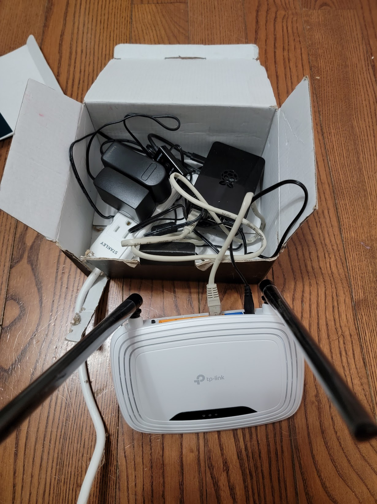
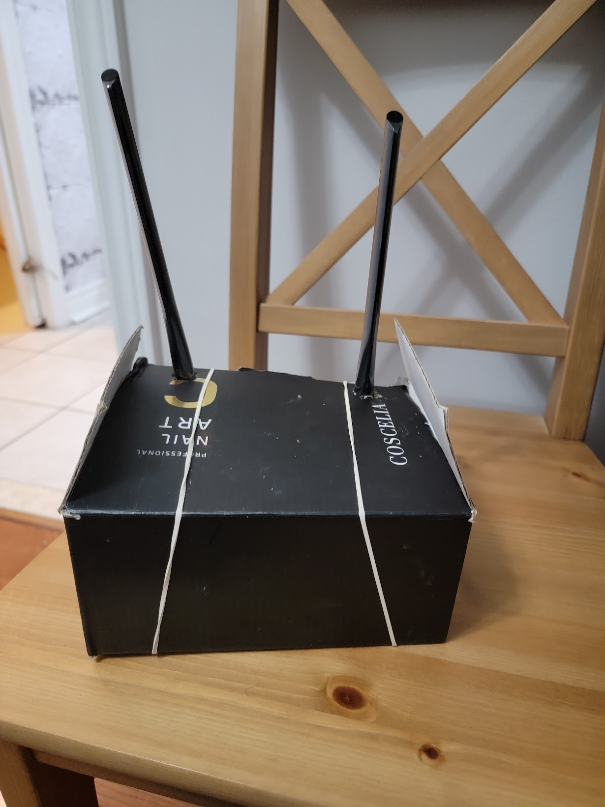

I have many smart devices, and connecting them directly to the main internet modem of the house is not ideal. If I move to a new house or change the wireless password, I would have to reconnect all the devices. Although modern devices are smarter in provisioning and easier to connect when changing passwords, I still prefer my "Personal IOT Server" solution.

I placed a Raspberry Pi connected to an SSD drive inside a box. The Pi is also connected to a cheap 2G modem (~ $15). All my smart devices connect to this modem, and this modem is connected to the main internet modem. I refer to this setup as my personal IoT center.

This configuration allows me to customize the modem settings extensively, such as assigning static IPs and setting long, complex passwords for the Wi-Fi, without interfering with the home internet modem. When I move to a new house, all I need to do is connect this modem to the new house modem, and all the smart devices will work Immediately.

The Raspberry Pi inside the box runs MotionEye software to detect motion from my cameras and store the footage on the attached SSD [see my "ESP32 Cam" post](/posts/esp32-cam). Additionally, I use the Raspberry Pi to place some of my smart devices and my cell phone on the same network to reach their data when I'm out of the house. For this, I use the free service from <a href="https://www.zerotier.com" target="_blank">ZeroTier</a>, which works excellently.

Inside my personal IoT server:

Finished product:

