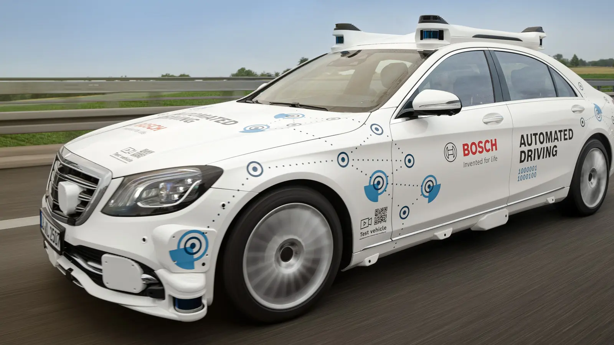
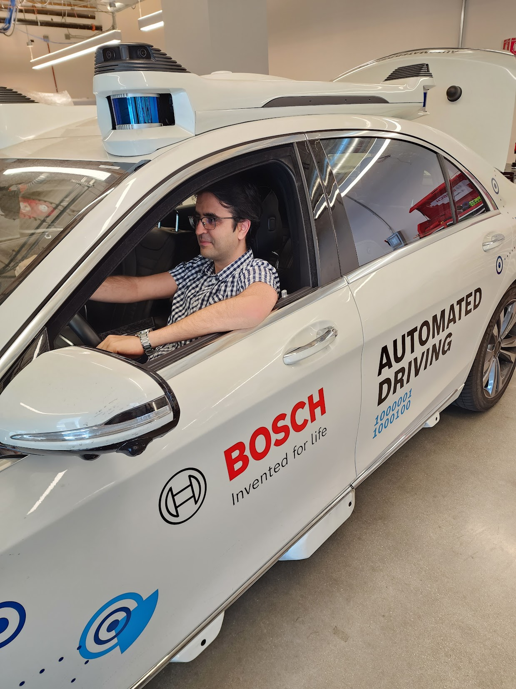

In 2021, I joined Robert Bosch's Sunnyvale, California branch, collaborating with the Localization and Fusion teams on a Level 4 autonomous driving project. Our platform was a Mercedes S-Class equipped with an array of sensors, including multiple cameras, lidars, radars, GNSS, microphones, and ultrasound sensors. 

Interestingly, not many people are aware that Bosch is the world's largest automotive supplier, employing approximately 400,000 people globally. Even I didn't know that before the interview.

The level 4 autonomous driving platform:

Caught it in action:

