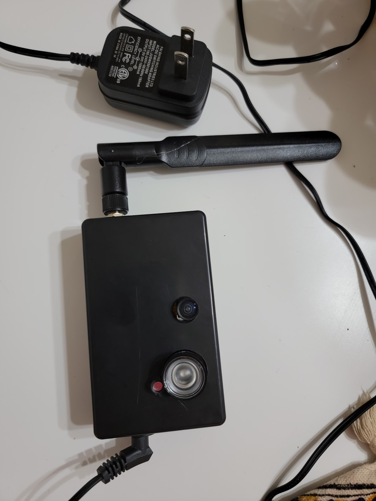

The ESP32-Cam by ESPRESSIF is an affordable board ideal for creating a low-cost monitoring system. I assembled several units for around $6 each by sourcing parts from AliExpress. For some units, I added IR projectors to enable night vision, primarily to observe raccoons messing around with my garbage bin at night. All cameras were connected to a Raspberry Pi running a <a href="https://github.com/motioneye-project/motioneyeos" target="_blank">Motion Eye</a> Docker image, which enables motion detection and data storage. Even though the project was successful, the boards typically only lasted for one to two months.

