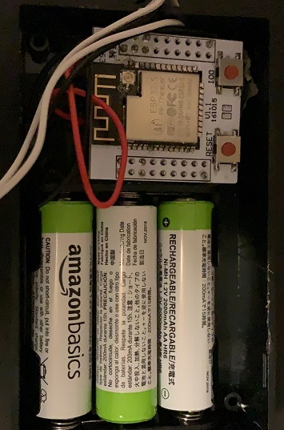

When I bought my first house in Toronto, I always feared having a leak in my basement without knowing it. Basement leaks due to snow, rain, or water pipe breaks are common in Toronto and can cause serious damage to the house. Therefore, as a fun DIY project, I started to develop a "Leak Detector" to be placed throughout the basement. In case of a leak, it sends a message to my phone. The project was  successful.
The main challenge I had was putting the board into deep sleep mode to prevent it from draining the battery. It wasn't easy with the cheaper ESP32 boards. Additionally, every few hours, the board must wake up and send a health signal to the phone ensure the system is actively monitoring for leaks. Getting such a system to run reliably for months was not easy (at least for me). 

Success Story: I used to get false positive messages once in a while. Because Toronto is so humid, sometimes the floor gets wet enough that the system thinks there is a leak. One day, I got a "Leak Detected" message in the basement. I thought it was another false alarm, but when I went there, I found that the shower pipes going upstairs were leaking into the laundry room. At that moment, I was extremely happy because the system finally worked, even though it could have cost me thousands of dollars. I called a plumber, and he was also amazed by my system. The joy of that leak detection cost me $200.

The project, and code and technical details are available here:
[Leak Detector github project](https://github.com/mmazat/LeakDetectorESP32)

Picture of one of the devices

