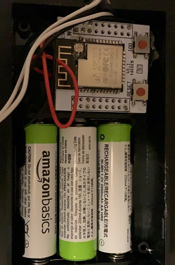

When I bought my first house in Toronto, I always had fear of having leak in my basement, without me knowing that. Basement leak due to snow, rain, or water pipe break is common in Toronto and can cause a serious damage to the house. Therefore, as a fun project, I started to develop a "Leak Detector" to be placed everywhere in the basement, and in case of leak, it messages on my phone. The project was successful.

The main chalange I had was to put the board in deep sleep, so it doesn't drain the battery. It is wasn't easy with cheaper board. Also every few hours, the board must wake up and send a health signal, so you kow the system is really watching for leak. Getting such a system running for months reliably was not easy. 

Success Story: I used to get false positive messages once in a while, Because Toronto is so humid, that sometimes makes the floor wet enough that the system thinks there is a leak. One day I got "Leak Detected" message in the basement, I thought it is another false one, I went there, and yes, the shower pipes going upstairs were leaking to the laundary room. At the time I was extremly happy because system finally worked, eventhough it could cost me thousands of dollar. Called a plumber and he was amazed by my system. The joy of leak detection cost me 200$.

[Leak Detector github project](https://github.com/mmazat/LeakDetectorESP32)

