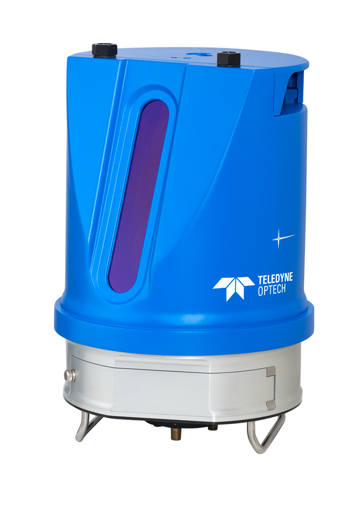
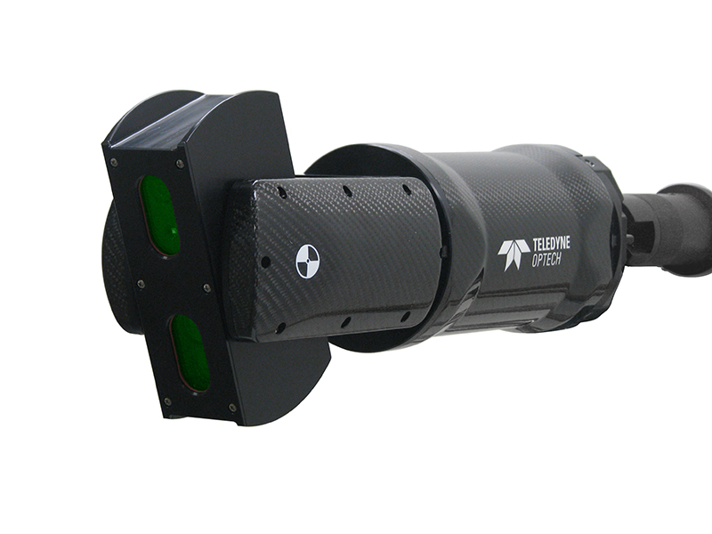

During my time at Teledyne Optech in Toronto from 2015 to 2018, I collaborated with a talented team of hardware and software developers on a variety of innovative projects.

I contributed to the development of various modules for the Polaris, Maverick, and CMS terrestrial laser scanners. My work included tasks such as camera calibration, detecting surveying targets within point clouds and calculating their precise centroids, lidar internal calibration, and sensor fusion.

Tripod mounted surveying grade laser scanner:

Compact lidar/camera/IMU mobile mapping solution:

Cavity Monitoring System for mining industries:

An interesting fact about the Maverick system is that it was utilized by HBO to create detailed 3D models of city of Dubrovnik, which is used in production of "Game of Thrones." Watch this video to learn more:

<iframe width="560" height="315" src="https://www.youtube.com/embed/PTRqjOR4awU" title="Teledyne Optech Video" frameborder="0" allow="accelerometer; autoplay; clipboard-write; encrypted-media; gyroscope; picture-in-picture" allowfullscreen></iframe>

