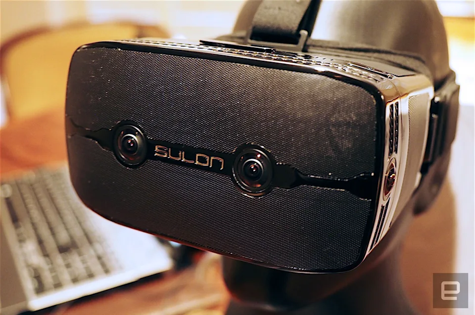

In 2015, I worked at Sulon Technologies, a Toronto-based startup focused on developing a mixed AR/VR headset. The device concept was innovative, capable integrating both augmented and virtual reality. As the lead SLAM developer, I implemented a multi-camera visual SLAM system optimized to run efficiently on the device's low-end CPU. Through various optimization techniques, we achieved high-frequency positioning, pushing the boundaries of what was possible at the time.

There is a cool demo of the system, presented at CES.
<iframe width="560" height="315" src="https://www.youtube.com/embed/pp90zGjydwI" frameborder="0" allowfullscreen></iframe>
