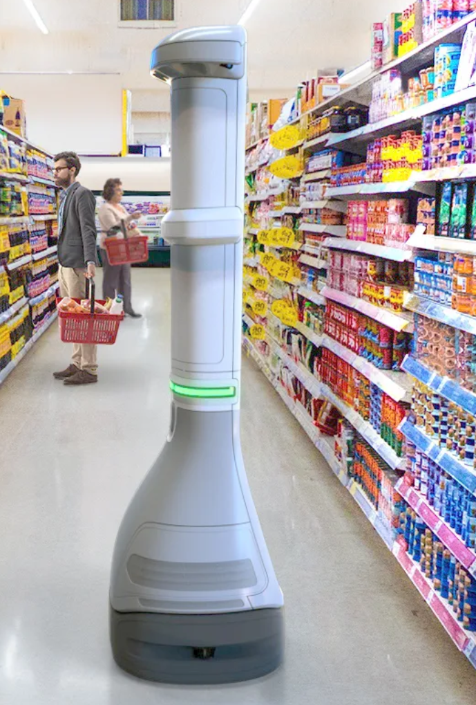
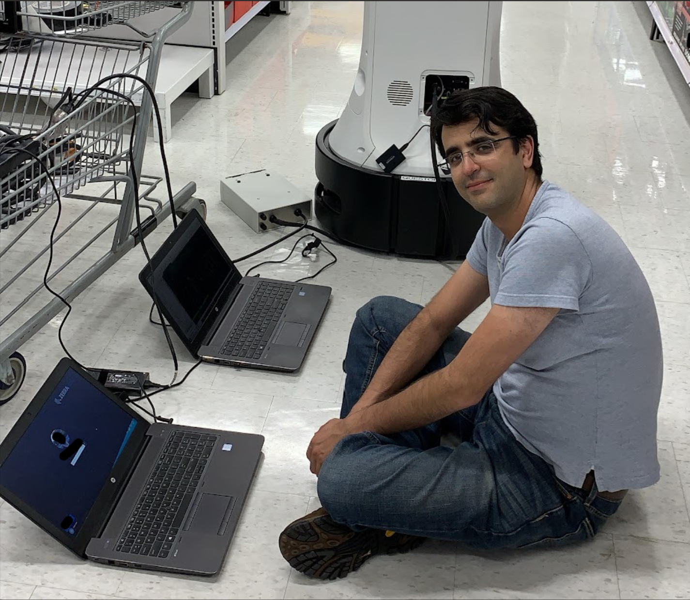

In 2018, I joined Zebra Technologies to develop autonomous robots for major retail stores and warehouses. The robot, later named [Zebra Smart Sight](https://connect.zebra.com/smartsight), was designed to autonomously scan store shelves, collect inventory data, and report any necessary actions required to store management.

I developed the visual SLAM initially and then led a team to elevate it to a tightly coupled visual, lidar, and odometry SLAM. Later on, I joined the CV/AI team to work on object detection. This project was the most complex I have ever done: architecture and development of a tightly coupled multi-sensor SLAM solution.

Here is an image of the Zebra Smart Sight:

I spent many nights testing this robot in retail stores, as daytime testing would interfere with normal store operations. Below is a picture of me diagnosing a robot at 3 AM:

